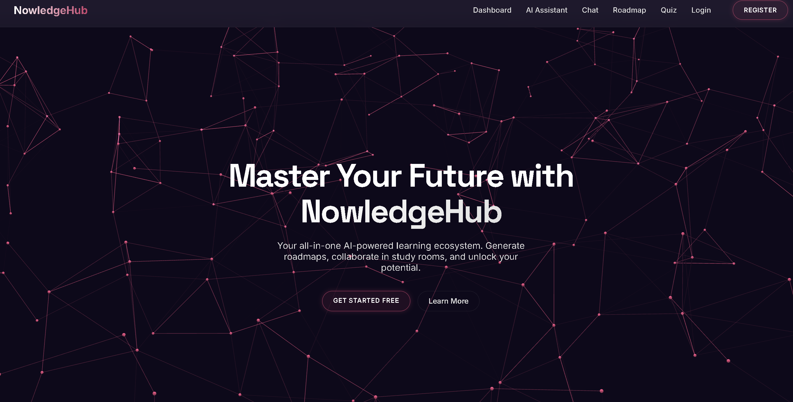

# NowledgeHub - AI Learning Platform 🚀

**NowledgeHub** is an advanced, AI-powered collaborative learning platform designed to revolutionize how students study. It combines real-time collaboration with cutting-edge Generative AI to provide personalized tutoring, deep research capabilities, and interactive study tools.




---

## ✨ Key Features

### 🧠 Advanced AI Assistant
- **Deep Research Agent**: Autonomous agent that performs multi-step research on complex topics, synthesizing information into comprehensive reports.
- **PDF RAG (Retrieval-Augmented Generation)**: Upload study materials (PDFs) and chat with them. The AI cites specific sections from your documents.
- **Context-Aware Chat**: Remembers your conversation history for a seamless tutoring experience.

### 📚 Personalized Learning Tools
- **AI Roadmap Generator**: Creates step-by-step learning paths for any skill (e.g., "Learn React in 30 days").
- **AI Quiz Generator**: Instantly generates multiple-choice quizzes to test your knowledge on any topic.

### 🤝 Collaborative Space
- **Real-time Study Rooms**: Join live sessions with friends using Socket.IO-powered chat.
- **Pomodoro Timer**: Synchronized timers to keep group study sessions focused.

### 🔐 Security & User Experience
- **Secure Authentication**: JWT-based sessions with Email Verification.
- **Interactive UI**: Glassmorphism design with dynamic **Vanta.js** backgrounds.
- **Instant Notifications**: Real-time alerts using React Hot Toast.

---

## 🛠️ Tech Stack

### Frontend
- **React.js**: Dynamic UI with functional components and Hooks.
- **State Management**: React Context & Hooks.
- **Styling**: Vanilla CSS3, Glassmorphism design, Responsive layouts.
- **Visuals**: **Vanta.js** (Fog Effects), **React Icons**.
- **Real-time**: `socket.io-client`.
- **Markdown Rendering**: `react-markdown`, `remark-gfm`, `react-syntax-highlighter`.
- **Notifications**: `react-hot-toast`.

### Backend
- **Node.js & Express**: Robust REST API architecture.
- **Database**: **MongoDB Atlas** (with Vector Search for RAG).
- **AI Integration**: 
    - **LangChain.js**: For orchestration, vector similarity search, and RAG pipelines.
    - **Google Gemini API**: Powered by `gemini-2.5-flash` for high-speed inference and `gemini-embedding-001` for vector embeddings.
- **Authentication**: **JWT** (JSON Web Tokens) & **Bcrypt.js** (hashing).
- **Email Service**: **Nodemailer** (SMTP) for sending verification codes.
- **File Handling**: **Multer** (Memory Storage) & **pdf-parse** for on-the-fly document processing.
- **Real-time**: `socket.io` for bidirectional communication.

---

## 🚀 Getting Started

### Prerequisites
- Node.js (v18+)
- MongoDB Atlas Account (Cluster with Vector Search enabled)
- Google Gemini API Key
- Gmail Account (for Nodemailer SMTP)

### Installation

1. **Clone the repository**
   ```bash
   git clone https://github.com/your-username/NowledgeHub.git
   cd NowledgeHub
   ```

2. **Setup Backend**
   ```bash
   cd backend
   npm install
   
   # Create .env file
   cp .env.example .env
   ```
   *Update `.env` with your credentials:*
   ```env
   PORT=5000
   MONGO_URI=your_mongodb_atlas_uri
   JWT_SECRET=your_secure_secret
   GEMINI_API_KEY=your_google_ai_key
   EMAIL_HOST=smtp.gmail.com
   EMAIL_PORT=587
   EMAIL_USER=your_email@gmail.com
   EMAIL_PASS=your_app_password
   ```

3. **Setup Frontend**
   ```bash
   cd ../frontend
   npm install
   
   # Create .env file if needed
   echo "REACT_APP_API_URL=http://localhost:5000" > .env
   ```

4. **Run Application**
   - **Backend**: `npm run server` (http://localhost:5000)
   - **Frontend**: `npm start` (http://localhost:3000)

---

## 🌐 Deployment Logic

### Frontend (Vercel/Netlify)
1. Push code to GitHub.
2. Import repository to Vercel.
3. Set Environment Variable: `REACT_APP_API_URL` = `https://your-backend-url.onrender.com` (or wherever backend is hosted).
4. Deploy!

### Backend (Render/Heroku/Railway)
1. Push code to GitHub.
2. Create new Web Service on Render.
3. Set Build Command: `npm install`
4. Set Start Command: `npm start`
5. Add all environment variables from your `.env` file.
6. **Important**: Ensure your IP (from Render/Heroku) is whitelisted in MongoDB Atlas or set to allow all IPs (`0.0.0.0/0`).

---

## 🔮 Future Improvements
- [ ] Voice Mode for AI interaction.
- [ ] Dynamic RAG System
- [ ] File sharing in Study Rooms.

---

Made by Swati Shah!
